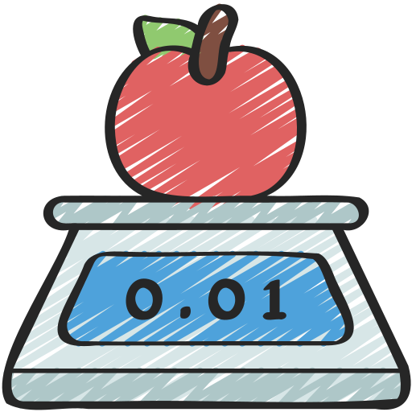

# Food Calorie Estimator Using AI

 <!-- Add a project banner or logo if available -->

## Overview

The Food Calorie Estimator is an AI-powered web application that allows users to upload images of food and get an estimate of the total calories in the food items. By leveraging a Large Language Model (LLM) for food identification and an external API for calorie calculation, this project provides an intuitive and accurate way to assess nutritional information.

## Features

- **AI-Powered Food Recognition**: Identifies food items from images using a Large Language Model (LLM).
- **Calorie Calculation**: Retrieves accurate calorie information using an external API (`api_ninza`).
- **User-Friendly Interface**: Simple and interactive UI built with Gradio for easy image upload and calorie display.
- **Deployment**: Hosted on Hugging Face for seamless access and scalability.

## Tech Stack

- **Programming Language**: Python
- **Machine Learning**: Large Language Model (LLM)
- **API Integration**: api_ninza (for calorie information)
- **Web Interface**: Gradio
- **Deployment Platform**: Hugging Face
- **Libraries/Frameworks**: 
  - TensorFlow/PyTorch (for LLM)
  - Requests (for API calls)
  - Gradio
- **Version Control**: Git/GitHub

## Installation

### Prerequisites

- Python 3.7+
- pip (Python package installer)
- Hugging Face account
- api_ninza API key

### Clone the Repository

```bash
git clone https://github.com/Iconic-Aman/Food-Calorie-Estimator-Using-AI.git
cd food-calorie-estimator-using-ai
